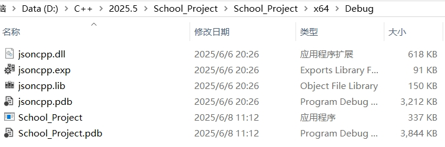

# Electronic-ticket-system-for-tourist-attractions

#### Description
​	A multi-channel transfer server based on epoll has been implemented. epoll acquires TCP connections and request events, locks them and pushes them to the task queue. The thread pool acquires tasks and conducts SQL queries to the MySQL connection pool. After obtaining the results, the response is sent by the write event of epoll. It also comes with a simple client based on Easyx, which can achieve simple communication with the server.

#### Development environment and technical knowledge used
​	C/C++, VS2022, VSCode, Xshell, Singleton Pattern, Multithreading, Mutex Lock, Condition Variable, Thread Pool, MySQL

#### Installation

- Client

​	Import header files and source files in Visual Studio 2022, place the Jsoncpp library under the executable program of the Visual Studio 2022 project, and then set Jsoncpp to the file directory of Visual Studio 2022. Modify the project Settings, change "C/C++/ Code generation/runtime library/" to" DLL ", and change the configuration attribute "Advanced/character set" to use a multi-byte character set. Then it can be compiled and run. For example:



- Server

​	Take centos7 as an example. Make sure there are the MySQL C connect library and the Jsoncpp library. Pull the server-side code to the server, find the file location of the Log in the code and modify it to the location. Then, directly make in the project directory terminal, and you can compile it using Makefile.

```
Start the server:
	./Server port number
View the Log output:
	tail -n 100 -f path /log.txt
```

#### Contribution

1.  Fork the repository
2.  Create Feat_xxx branch
3.  Commit your code
4.  Create Pull Request


#### Server Process

​	// TODO
